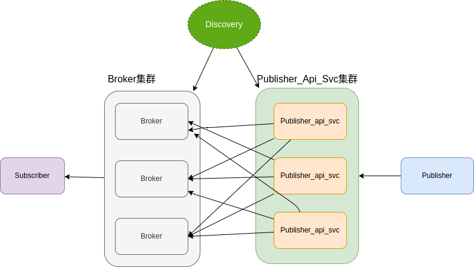

# livewin-chat(live 聊天室服务)

轻量化分布式消息订阅系统，订阅端使用websocket协议。


## Features

- `Subscriber`需要唯一标识，`Publisher`支持批量给多个`Subscriber`发消息。
- `Subscriber`可以订阅一个频道（`Channel`），`Publisher`给`Channel`发消息，每一个在线`Subscriber`都能收到消息。
- `Publisher`还可以发广播消息（`Broadcast`）,每一个在线`Subscriber`都能收到消息。


> [!NOTE]
> 注意这个`livewin-chat`暂时不支持离线消息

## 架构设计



- Broker

    `Broker`主要负责和客户端维护链接，接收消息并且推送给客户端。`Broker`需要集群化以支持更多的连接数。为了好运维和拓展，`Broker`还需要设计成`stateless`,可以无限横向拓展，可以放在传统负责均衡后面，在k8s集群中可以在service后面。

- Publisher_Api_Svc

    `Publisher_Api_Svc`作为发送信息的接收器，负责接收消息,并将消息推送到各个`Broker`。`Publisher_Api_Svc`需要感知到所有的`Broker`并且和`Broker`通过`grpc`通讯，轻量化服务发现可以使用`Mdns`实现(需要所有服务在同一个内网)，这样中可以简化服务组件，大型系统可以使用`etcd，consul`等服务发现组件，`Publisher_Api_Svc`可以通过服务发现知道所有的`Broker`地址。

- 架构延伸

    超大型消息系统，可以在`Publisher_Api_Svc`和`Broker`中加入异步消息系统，例如`Publisher_Api_Svc`接收消息往`kafka`发，再几个一个服务消费消息，往`Broker`发消息。`kafka`的`topic`可以增加`partition`来承载更大的消息处理量。


## Run demo

start the terminal
```bash
$ go run bin/broker/main.go
```

start another terminal

```bash
$ go run bin/publisher_api_svc/main.go
```

run live server on example folder,it will open `http://127.0.0.1:5500/example/index.html` in the browser。


start the third terminal

```bash
$ curl -d 'broadcast in channel message' 'http://localhost:9653/broadcastinchannel?channel=channel1'
$ curl -d 'broadcast message' 'http://localhost:9653/broadcast'
```

watch on the browser，it will got the messages。
